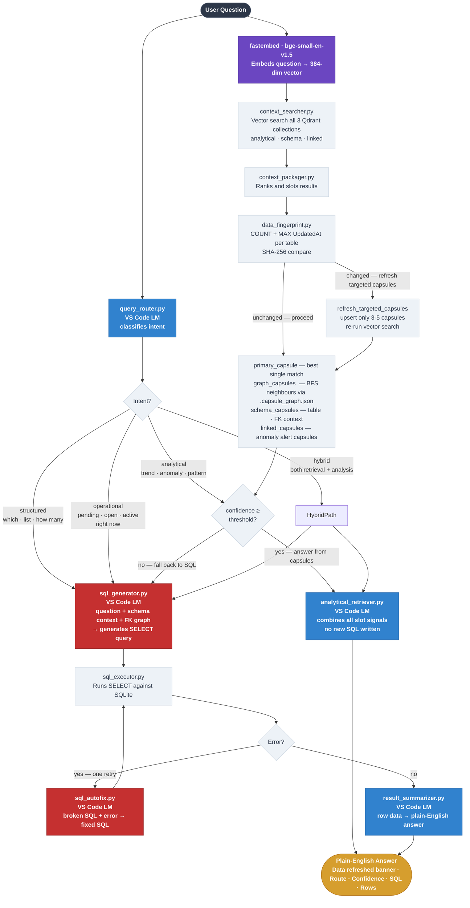

# Analytical Search Engine

A **database-agnostic, schema-agnostic** analytical question-answering system. Connect it to any SQLite database and ask plain-English questions — the engine figures out the SQL, retrieves pre-computed insights, and delivers a natural-language answer.

No changes to the core engine are needed when switching databases. You only swap out the configuration folder.

---

## Quick Start

### Prerequisites

| Requirement         | Details                                                                   |
| ------------------- | ------------------------------------------------------------------------- |
| **Python**          | 3.11 or 3.13 recommended                                                  |
| **VS Code**         | With GitHub Copilot extension — provides the LLM via the VS Code LM API   |
| **fastembed_cache** | Pre-bundled in the repo — no internet download needed                     |

### 1 — Clone the repo

```bash
git clone https://github.com/your-org/structured-data-search-engine
cd structured-data-search-engine
```

### 2 — Create a virtual environment (recommended)

```bash
py -3 -m venv .venv
.venv\Scripts\activate        # Windows
# source .venv/bin/activate   # macOS / Linux
```

### 3 — Install all dependencies

```bash
py -3 -m pip install -r requirements.txt
```

**What gets installed:**

| Package                          | Purpose                                              |
| -------------------------------- | ---------------------------------------------------- |
| `streamlit`                      | Web UI                                               |
| `qdrant-client`                  | Local vector database                                |
| `fastembed`                      | Embedding model (bge-small-en-v1.5, 384-dim, ~63 MB) |
| `pydantic` / `pydantic-settings` | Settings and data models                             |
| `python-dotenv`                  | Reads `.env` file                                    |
| `numpy` / `scipy`                | Anomaly scoring and statistics                       |

> **Note:** The embedding model (`BAAI/bge-small-en-v1.5`, 384-dim, ~63 MB) is pre-bundled in `fastembed_cache/` — no internet access or download required on first run.

### 4 — Create your `.env` file

Create a file named `.env` in the project root:

```env
# ── Optional (defaults shown) ─────────────────────────────────────────────────

# Qdrant vector store path (local folder, auto-created)
QDRANT_PATH=./qdrant_data

# SQLite database path
SQLITE_DB_PATH=./data/compliance.db

# Set to 1 to print all executed SQL to the console
SQL_DEBUG=0
```

### 5 — Set up your database (first time only)

The SQL schema and seed data script is at `src/business_schema/dbscript.sql`. It is automatically run when the app starts if the database file does not exist.

All tables include an `UpdatedAt TEXT DEFAULT (datetime('now'))` column used for data change detection.

### 6 — Install the VS Code LM extension

The engine uses the VS Code Language Model API for all LLM tasks (intent detection, SQL generation, answer summarization). Install the companion extension:

```bash
cd vscode-lm-extension
npm install
npm run compile
```

Then press **F5** in VS Code to run the extension host, or install the `.vsix` file if packaged.

The extension requires **GitHub Copilot** to be active in VS Code.

### 7 — Run the app

```bash
py -3 -m streamlit run streamlit_app.py
```

Open your browser at **http://localhost:8501**

### 8 — Generate capsules (first time only)

In the browser, click the **Generate Capsules** tab → **Generate All Capsules**.  
This runs all SQL queries, embeds the results, and builds the vector knowledge base.  
Takes 1–3 minutes depending on DB size. The sidebar collection counts will update when complete.

---

## What It Does

You type a question like:

> _"Which broker dealer has the highest rejection rate?"_

The engine:

1. Understands what you're asking (intent detection)
2. Searches its pre-built knowledge base (vector search)
3. Checks whether the underlying data has changed since the last capsule build — and refreshes only the relevant capsules if so
4. Either answers directly from cached insights **or** writes and runs a live SQL query
5. Returns a plain-English answer with the data behind it

---

## Key Concepts

### Capsules

A **capsule** is a pre-computed unit of knowledge. Before you ask a question, the engine runs all the SQL queries defined in your configuration, compresses the results into a summary ("signal"), and stores everything in a vector database. Capsules are the engine's long-term memory.

There are three types:

| Type                      | What it is                                                                                                  | Count (example) |
| ------------------------- | ----------------------------------------------------------------------------------------------------------- | --------------- |
| `analytical_capsules`     | Pre-run SQL results + signals for common business questions (`aggregation`, `trend`, `violation`, `risk`, `pattern`, `operational`) | ~39 |
| `schema_context_capsules` | Maps of the database structure — which tables join to what                                                  | 5               |
| `linked_capsules`         | Auto-generated linked capsules — risk/anomaly alerts from capsule cross-analysis                            | ~17             |

### Two Pipelines

| Pipeline           | Name              | When it runs                       | What it does                                                                     |
| ------------------ | ----------------- | ---------------------------------- | -------------------------------------------------------------------------------- |
| `capsule_builder/` | Knowledge Builder | When you click "Generate Capsules" | Runs all SQL, computes signals, builds the graph, stores to Qdrant               |
| `query_engine/`    | Answer Engine     | Every time a user asks a question  | Searches Qdrant, routes the question, generates SQL if needed, returns an answer |

---

## Change Detection

The engine automatically detects when your data has changed and refreshes only the capsules needed to answer the current question.

### Data Change Detection (per query)

On every search query, the engine:

1. Computes a fingerprint of all 7 tables using `COUNT(*) + MAX(UpdatedAt)` per table → SHA-256 hash
2. Compares against the previously stored fingerprint (in `data/.data_fingerprint.json`)
3. If changed, refreshes **only** the 3–5 capsules relevant to the current question (targeted upsert — other capsules are untouched)
4. Re-runs the vector search with the refreshed data before answering

This relies on each table having an `UpdatedAt` column updated whenever a row changes. All 7 tables in the compliance schema include this column as a prerequisite.

### Schema (DDL) Change Detection (at startup)

When the Streamlit app starts (once per browser session), the engine:

1. Computes a fingerprint of the current DB schema (`PRAGMA table_info` + `PRAGMA foreign_key_list` for all tables) → SHA-256 hash
2. Compares against `data/.schema_fingerprint.json`
3. If the schema changed (columns added/removed, tables restructured), triggers a **full capsule rebuild** automatically

This means adding a new column or table in `dbscript.sql` and re-running the app will auto-rebuild all capsules without manual intervention.

---

## User Capsule Creation

The **Insert Capsule** tab allows users to create and save their own analytical capsules without editing any Python files:

1. Enter a capsule ID, type, priority, and description
2. Write the SQL query
3. Click **Validate & Preview** — runs the SQL and shows up to 50 result rows
4. If valid, click **Save & Build** — the capsule is:
   - Saved permanently to `data/user_capsules.json`
   - Built immediately (SQL executed, signal generated, embedded, upserted into Qdrant)
   - Available for search in the next query

User capsules are:
- **Included in all refresh operations** — targeted refresh, full rebuild, and schema refresh all include user capsules
- **Shown in the Explorer** with a delete option
- **Checked by data fingerprint** — if the underlying data changes and that capsule was used to answer a query, it will be refreshed automatically

Built-in capsule definitions in `capsule_definitions.py` are not modified at runtime.

---

## Architecture

```
SQLite Database (compliance.db)
        │
        ▼
 ┌──────────────────────────────┐
 │       capsule_builder/       │  ← runs once (or on-demand)
 │  Execute SQL → Extract Signal│
 │  Embed → Store in Qdrant     │
 └──────────────┬───────────────┘
                │  writes to
                ▼
      ┌─────────────────┐
      │  Qdrant (local) │  ← 3 collections
      │  analytical     │
      │  schema_context │
      │  linked         │
      └────────┬────────┘
               │  read by
               ▼
 ┌──────────────────────────────┐
 │        query_engine/         │  ← runs on every question
 │  Route → Retrieve → Answer   │
 │  Data fingerprint check      │
 │  Targeted capsule refresh    │
 │  or Generate + Run SQL       │
 └──────────────────────────────┘
                │
                ▼
         Plain-English Answer
```

---

## Business Schema Configuration

Everything specific to your database lives in one folder:

```
src/business_schema/
  capsule_definitions.py   ← all queries, priorities, and schema maps
  dbscript.sql             ← your database creation script + seed data
  Sample_Questions.md      ← example questions for this domain
```

**To deploy against a different database:** delete this folder, drop in a new one for your new domain. The core engine does not need to change.

Inside `capsule_definitions.py` there are two lists:

- **`SCHEMA_DEFINITIONS`** — entries describing how the tables relate to each other. Used to guide SQL generation.
- **`CAPSULE_DEFINITIONS`** — the full set of analytical queries the engine pre-runs and stores.

---

## Project Structure & What Each File Does

```
streamlit_app.py            ← Web UI entry point (all tabs rendered here)
requirements.txt            ← Python dependencies
.env                        ← Your config (DB path, Qdrant path) — never commit this
README.md

src/
  config.py                 ← Reads .env into a typed Settings object (pydantic-settings)
  app_constants.py          ← Shared constants: collection names, score thresholds, path config
  models.py                 ← Data models (GeneratedCapsule, SchemaContextCapsule, BuildSummary, DataFingerprint...)
  llm_instructions.py       ← All LLM system + user prompt templates
  database_connection.py    ← SQLite connection, schema metadata discovery via PRAGMA
  llm_service.py            ← Thin wrapper around VS Code LM API (call_llm / call_llm_json)
  embedding.py              ← Text → vector via fastembed (bge-small-en-v1.5); manages fingerprint + plan files
  vector_store.py           ← Qdrant read/write: upsert, scroll, search, delete, reset
  data_fingerprint.py       ← Data change detection: COUNT + MAX(UpdatedAt) per table → SHA-256 hash

  capsule_builder/          ← Pipeline 1 — runs offline to build the knowledge base
    store_manager.py        ← Master orchestrator: calls all generators, persists results, saves plan
    capsule_generator.py    ← Runs each capsule's SQL, calls LLM for signal, returns capsule
    user_capsule_builder.py ← Builds and upserts a single user-created capsule into Qdrant
    schema_capsule_generator.py  ← Turns SCHEMA_DEFINITIONS into embedded schema context capsules
    ml_enricher.py          ← Computes anomaly score (numpy Z-score) and trend direction (moving average)
    relationship_builder.py ← Finds capsule overlaps by entity, generates linked risk capsules
    append_capsules.py      ← Writes a new capsule dict into capsule_definitions.py + embeds it

  query_engine/             ← Pipeline 2 — runs on every user question
    orchestrator.py         ← Entry point: coordinates all steps, data fingerprint check, returns final answer
    query_router.py         ← Classifies intent (structured/analytical/hybrid/operational); keyword fallback if LLM fails
    context_searcher.py     ← Vector searches all 3 Qdrant collections for relevant capsules
    context_packager.py     ← Ranks and packages primary + linked + schema + related context
    analytical_retriever.py ← Answers directly from capsule signal when confidence is high enough
    sql_generator.py        ← Sends schema context + question to LLM, gets back a SELECT query
    sql_executor.py         ← Executes the SQL query against SQLite, returns row dicts
    sql_autofix.py          ← On SQL error, sends broken SQL + error to LLM for one fix attempt
    result_summarizer.py    ← Summarizes SQL result rows into plain-English business answer

  business_schema/          ← Domain configuration — swap this folder to change database domains
    capsule_definitions.py  ← CAPSULE_DEFINITIONS list (SQL + metadata per capsule) + SCHEMA_DEFINITIONS
    user_capsules.py        ← CRUD for user-created capsule definitions in data/user_capsules.json
    dbscript.sql            ← Full DDL + sample data (all tables include UpdatedAt column)
    Sample_Questions.md     ← Example questions that work well with this schema

  vscode-lm-extension/      ← VS Code extension that bridges Streamlit ↔ VS Code LM API
    src/extension.ts        ← Registers the LLM HTTP endpoint; uses GitHub Copilot model families

data/                       ← Runtime cache files (auto-created, safe to delete and rebuild)
  .analytical_refresh_plan.json  ← Last-run capsule plan (used by Refresh Data button)
  .schema_fingerprint.json       ← Hash of DB schema (used by Schema Refresh / startup check)
  .capsule_graph.json            ← Capsule relationship graph (used by Capsule Graph tab)
  .data_fingerprint.json         ← Hash of table row counts + MAX(UpdatedAt) (checked on every query)
  user_capsules.json             ← User-created capsule definitions (persisted across rebuilds)

qdrant_data/                ← Local Qdrant vector store persistence (auto-created)
fastembed_cache/            ← Pre-bundled bge-small-en-v1.5 model (384-dim, ~63 MB, no download needed)
```

---

## End-to-End Flow: Generating Capsules

> This runs when you click **Generate All Capsules** in the UI.
> The goal: pre-run all SQL queries, extract meaningful signals, and store everything as searchable vectors.

```
capsule_definitions.py  +  user_capsules.json
       │
       │  provides: list of capsule dicts
       │  (each has: capsule_id, SQL, what, how, ttl_hours, tags, priority...)
       ▼
store_manager.py  ← master coordinator
       │
       ├─── capsule_generator.py
       │         │  reads each capsule definition
       │         │  runs SQL against SQLite (database_connection.py)
       │         │  if signal_method = "llm_summary":
       │         │      calls VS Code LM with SIGNAL_GENERATION_SYSTEM prompt
       │         │      LLM writes 2–3 sentence signal from the raw rows
       │         │  if signal_method = "rule_based":
       │         │      picks top rows / computes summary without LLM
       │         │  then calls ml_enricher.py:
       │         │      computes anomaly_score (z-score on numeric columns)
       │         │      computes trend_direction (rising/falling/flat)
       │         └─► returns GeneratedCapsule (signal + rows + scores + embed_text)
       │
       ├─── schema_capsule_generator.py
       │         │  reads SCHEMA_DEFINITIONS from capsule_definitions.py
       │         └─► returns SchemaContextCapsule list (no SQL needed — pure metadata)
       │
       ├─── relationship_builder.py
       │         │  compares entity values across all analytical capsules
       │         │  for each high-anomaly capsule:
       │         │      calls VS Code LM with LINKED_SIGNAL_SYSTEM prompt
       │         │      LLM writes a 2-sentence risk alert for that entity
       │         └─► returns LinkedCapsule list + saves .capsule_graph.json
       │
       ├─── embedding.py
       │         │  takes embed_text from every capsule
       │         └─► calls fastembed (bge-small-en-v1.5) → 384-dim float vector
       │
       └─── vector_store.py
                 │  upserts each (capsule_id, vector, payload) into Qdrant
                 └─► analytical_capsules, schema_context_capsules, linked_capsules

Final saves:
  .analytical_refresh_plan.json  ← capsule IDs + expiry (for Refresh Data)
  .schema_fingerprint.json       ← DB schema hash (for Schema Refresh / startup check)
  .data_fingerprint.json         ← Table stats hash (baseline for per-query change detection)
```

---

## End-to-End Flow: Answering a Question

> This runs every time a user types a question and clicks Ask.
> The goal: return a plain-English answer using either pre-computed capsule signals or live SQL.

```
User types: "Which broker dealer has the highest rejection rate?"
       │
       ▼
orchestrator.py  ← entry point
       │
       ├─ Step 1: query_router.py
       │       sends question to VS Code LM with INTENT_DETECTION_SYSTEM prompt
       │       LLM classifies intent into one of four types:
       │         • "structured"   — direct retrieval ("which", "show", "list", "how many", "top")
       │         • "analytical"   — trends, patterns, anomalies ("over time", "unusual", "increasing")
       │         • "operational"  — live urgency state ("pending", "open", "active", "right now")
       │         • "hybrid"       — question contains both retrieval and analysis cues simultaneously
       │       If LLM fails, a keyword-counting fallback runs without any LLM call.
       │
       ├─ Step 2: context_searcher.py
       │       embeds the question (fastembed bge-small-en-v1.5)
       │       vector searches all 3 Qdrant collections
       │       returns top-K matching capsules from each collection
       │
       ├─ Step 3: context_packager.py
       │       ranks and groups the retrieved capsules:
       │         • primary_capsule  = best single match from analytical_capsules
       │         • graph_capsules   = capsules connected via .capsule_graph.json (BFS)
       │         • schema_capsules  = best matches from schema_context_capsules
       │         • linked_capsules  = anomaly/risk alert capsules relevant to the question
       │
       ├─ Step 4: data_fingerprint.py (check_and_refresh_if_needed)
       │       computes COUNT + MAX(UpdatedAt) per table → SHA-256
       │       compares with .data_fingerprint.json
       │       if data changed:
       │           refreshes only the capsules from Steps 2–3 (targeted upsert)
       │           re-runs Steps 2–3 to get fresh context
       │           sets data_refreshed = True (banner shown in UI)
       │
       ├─ Step 5A: if intent = "structured" OR "operational"
       │       → SQL path immediately (no capsule answer attempt)
       │       sql_generator.py assembles: question + schema context + FK relationships
       │           calls VS Code LM with SQL_GENERATION_SYSTEM prompt
       │           LLM returns a raw SQL SELECT query
       │           → sql_executor.py runs it against SQLite
       │           → if SQL error: sql_autofix.py sends broken SQL + error → gets corrected SQL
       │           → result_summarizer.py summarizes result rows into plain English
       │           → Answer returned with SQL shown + raw rows expandable
       │
       ├─ Step 5B: if intent = "analytical"
       │       checks overall_confidence from context_packager:
       │         • confidence ≥ threshold AND primary capsule exists:
       │             analytical_retriever.py
       │                 concatenates signal text from all context slots
       │                 calls VS Code LM with ANALYTICAL_ANSWER_SYSTEM prompt
       │                 LLM writes answer using only pre-computed signals (no new SQL)
       │                 → Answer returned immediately (milliseconds)
       │         • confidence too low OR top hit is schema-only:
       │             falls back to SQL path (same as Step 5A)
       │
       └─ Step 5C: if intent = "hybrid"
               runs BOTH paths in sequence:
               1. answer_from_capsules → capsule-based analytical view
               2. _run_sql_path       → generates and executes live SQL
               answer returned as two-part response:
                 "Capsule view: <signal-based insight>"
                 "SQL view: <live query result>"

Displayed to user:
  - Plain-English answer
  - "Data refreshed" banner (if targeted capsule refresh was triggered)
  - Route taken (capsule / SQL / hybrid)
  - Confidence score
  - Source SQL (if SQL path)
  - Raw result rows (expandable)
  - Telemetry log entry appended
```

---

## How Linked Capsules Are Established

Linked capsules connect risk patterns across multiple data dimensions — a broker with a high rejection rate _and_ compliance alerts, or an employee appearing in both a restriction violation capsule and a turnaround anomaly capsule.

### Phase 1 — Relationship Graph (`build_graph`)

After all analytical capsules are generated, `build_graph()` creates a graph of how capsules relate:

**Explicit edges** (declared in `capsule_definitions.py`):
- `linked_capsule_ids` — capsule IDs this capsule is related to
- `relationship_types` — `corroborates` / `drills_down` / `aggregates_up` / `same_entity`

**Inferred edges** (computed at generation time):

| Condition                                                         | Inferred relationship |
| ----------------------------------------------------------------- | --------------------- |
| Same table set used + different capsule type                      | `same_entity`         |
| A's tables are a strict subset of B's tables                      | `drills_down`         |
| B's tables are a strict subset of A's tables                      | `aggregates_up`       |
| ≥ 2 shared tags or a shared entity value found in result rows     | `corroborates`        |

The full graph is saved to `data/.capsule_graph.json` and visualized in the **Capsule Graph** tab.

### Phase 2 — Auto-Generated Risk Alert Capsules (`generate_linked_capsules`)

Any capsule with `anomaly_score > 0.0` triggers automatic creation of a linked capsule:

1. Anomaly score computed via Z-score on numeric result columns (`ml_enricher.py`)
2. First entity value from the capsule's first result row becomes `entity_name`
3. VS Code LM writes a 2-sentence risk alert tying the anomaly to the entity
4. A `LinkedCapsule` is created: `risk_level = critical` (score ≥ 0.8) or `high`
5. Alert is embedded and stored in the `linked_capsules` Qdrant collection

---

## The UI Tabs

| Tab                   | What it does                                                                             |
| --------------------- | ---------------------------------------------------------------------------------------- |
| **Ask Question**      | Type a plain-English question and get an answer; shows "Data refreshed" banner if capsules were auto-refreshed |
| **Generate Capsules** | Build or refresh the engine's knowledge base                                             |
| **Capsule Explorer**  | Browse all stored capsules with filters; delete user capsules; inspect SQL, signal, and metadata |
| **Capsule Graph**     | Visual graph of how capsules relate to each other and any anomaly alerts                 |
| **Telemetry**         | Log of all questions asked, routes taken, confidence scores, and timing                  |
| **Insert Capsule**    | Validate SQL → preview 50 rows → Save & Build a user capsule permanently                 |
| **Reset**             | Wipe all Qdrant collections; user_capsules.json is preserved                             |

---

## Generate Capsules — Four Buttons

| Button                    | What it does                                                                                      | When to use                                                               |
| ------------------------- | ------------------------------------------------------------------------------------------------- | ------------------------------------------------------------------------- |
| **Generate All Capsules** | Full rebuild — wipes Qdrant and regenerates everything from scratch (includes user capsules)      | First run, after changing `capsule_definitions.py`, or when something is broken |
| **Refresh Data**          | Re-runs only the analytical SQL queries; leaves schema and linked capsules untouched              | Routine refresh when DB data changed but structure hasn't                 |
| **Schema Refresh**        | Detects whether the DB schema changed (via fingerprint) and rebuilds everything if it has        | After adding or removing columns/tables in the DB                         |
| **Generate Capsule Definitions** | Sends live DB schema + FK relationships to LLM; regenerates the entire `CAPSULE_DEFINITIONS` list; validated with `ast.parse()` before writing | Bootstrap a new domain or after major schema changes |

---

## Technical Notes

- **Embedding model:** `BAAI/bge-small-en-v1.5` via fastembed — 384 dimensions, bundled in `fastembed_cache/` (~63 MB, no download needed)
- **LLM provider:** VS Code LM API (GitHub Copilot) — each task (intent, SQL gen, SQL fix, signal, summary, answer) calls the configured model family through the VS Code extension
- **Vector database:** Qdrant running entirely locally — no cloud account needed
- **SQL database:** SQLite file at `data/compliance.db` — no server, no ODBC driver required
- **SQL dialect:** SQLite — all generated and capsule queries are `SELECT` only; SQLite-compatible syntax enforced
- **Schema discovery:** Fully dynamic — engine reads `PRAGMA table_info` and `PRAGMA foreign_key_list` at runtime
- **Data change detection:** Per-query `COUNT(*) + MAX(UpdatedAt)` fingerprint → SHA-256; only changed capsules refreshed (3–5 instead of 50+)
- **Schema change detection:** At app startup, PRAGMA-based schema fingerprint compared against saved hash; full rebuild triggered if different
- **UpdatedAt requirement:** All tables must have an `UpdatedAt` column updated on every row change for data fingerprinting to detect modifications (not just insertions)
- **Anomaly & Trend Detection:** Pure deterministic statistical math via `numpy` (Z-scores for anomalies, moving averages for trends) — no LLM hallucination risk on data values
- **Data folder:** Always written to the repo root `data/` via `Path(__file__)` anchor — consistent regardless of launch directory

---

## How Capsules Are Built — Technical Flow

```mermaid
flowchart TD
    classDef input    fill:#2d3748,stroke:#4a5568,color:#fff,font-weight:bold
    classDef llm      fill:#3182ce,stroke:#2b6cb0,color:#fff,font-weight:bold
    classDef ml       fill:#6b46c1,stroke:#553c9a,color:#fff,font-weight:bold
    classDef store    fill:#38a169,stroke:#2f855a,color:#fff,font-weight:bold
    classDef process  fill:#edf2f7,stroke:#cbd5e0,color:#2d3748

    Defs([capsule_definitions.py\n+ user_capsules.json\nSQL · what · how · tags · TTL]):::input
    Schema([SCHEMA_DEFINITIONS\nTable maps · FK paths]):::input

    Defs --> RunSQL[Run SQL against SQLite]:::process
    Schema --> SchCap[Schema Capsule Generator\nno SQL needed — pure metadata]:::process

    RunSQL --> SigRoute{Signal Method?}:::process

    SigRoute -->|signal_method = llm_summary| SigLLM[VS Code LM\nwrites 2-3 sentence\nbusiness signal]:::llm
    SigRoute -->|signal_method = rule_based| SigRule[Rule engine\ntop value · concentration %\ntrend direction]:::process

    SigLLM --> MLEnrich
    SigRule --> MLEnrich

    MLEnrich[ml_enricher.py\nnumpy Z-score on numeric columns\nanomalyScore 0.0–1.0\ntrendDirection rising·falling·flat]:::ml

    MLEnrich --> LinkCheck{anomaly_score\n> threshold?}:::process

    LinkCheck -->|yes| AlertLLM[VS Code LM\nwrites 2-sentence\nrisk alert]:::llm
    LinkCheck -->|no| EmbedA

    AlertLLM --> AlertCap([LinkedCapsule\nalert_{source_capsule_id}\npattern signal · risk_level]):::store
    AlertCap --> EmbedB[fastembed\nbge-small-en-v1.5\n384-dim vector]:::ml
    EmbedB --> QdrantLinked[(Qdrant\nlinked_capsules)]:::store

    EmbedA[fastembed\nbge-small-en-v1.5\n384-dim vector]:::ml

    SigLLM --> EmbedA
    SigRule --> EmbedA
    SchCap --> EmbedA

    EmbedA --> QdrantMain[(Qdrant\nanalytical_capsules\nschema_context_capsules)]:::store

    MLEnrich --> GraphBuilder[relationship_builder.py\nExplicit + inferred edges\nSaved to .capsule_graph.json]:::process
    GraphBuilder --> QdrantMain

    QdrantMain --> PlanFile([.analytical_refresh_plan.json\ncapsule IDs]):::store
    QdrantMain --> FingerprintFile([.schema_fingerprint.json\nSHA-256 of PRAGMA schema]):::store
    QdrantMain --> DataFP([.data_fingerprint.json\nSHA-256 of COUNT+MAX per table]):::store
```

---

## How a Question Gets Answered — Technical Flow


