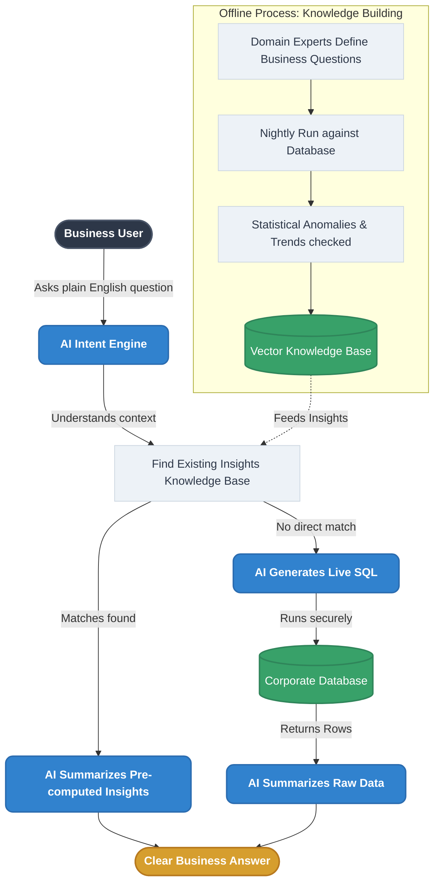
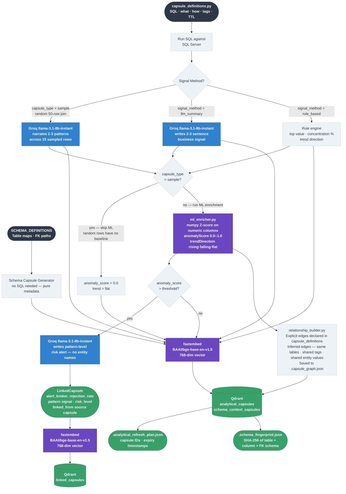
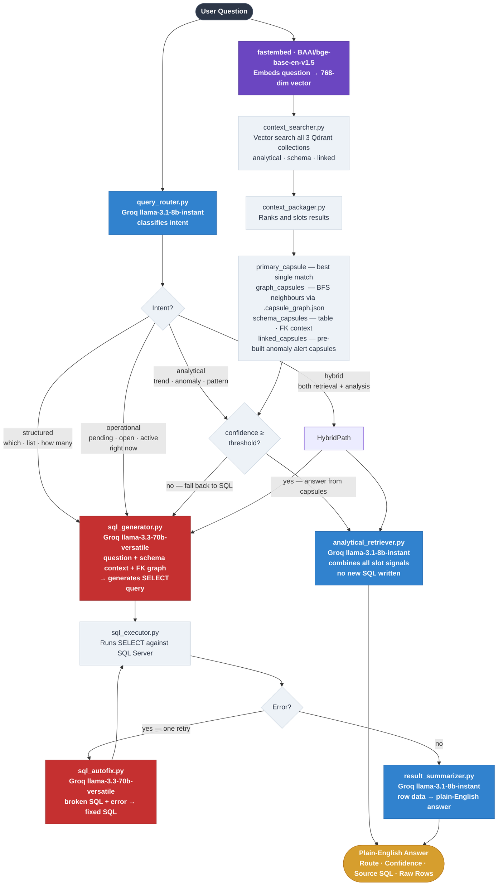

# Analytical Search Engine

A **database-agnostic, schema-agnostic** analytical question-answering system. Connect it to any SQL Server database and ask plain-English questions — the engine figures out the SQL, retrieves pre-computed insights, and delivers a natural-language answer.

No changes to the core engine are needed when switching databases. You only swap out the configuration folder.

---

## Quick Start

### Prerequisites

| Requirement        | Details                                                                                                           |
| ------------------ | ----------------------------------------------------------------------------------------------------------------- |
| **Python**         | 3.11 or 3.13 recommended                                                                                          |
| **SQL Server**     | Any edition (Express works); ODBC Driver 17 must be installed                                                     |
| **Groq API key**   | Free at [console.groq.com](https://console.groq.com)                                                              |
| **ODBC Driver 17** | [Download from Microsoft](https://learn.microsoft.com/en-us/sql/connect/odbc/download-odbc-driver-for-sql-server) |

### 1 — Clone the repo

```bash
git clone https://github.com/your-org/structured-data-search-engine
cd structured-data-search-engine
```

### 2 — Create a virtual environment (recommended)

```bash
py -3 -m venv .venv
.venv\Scripts\activate        # Windows
# source .venv/bin/activate   # macOS / Linux
```

### 3 — Install all dependencies

```bash
py -3 -m pip install -r requirements.txt
```

**What gets installed:**

| Package                          | Version | Purpose                                          |
| -------------------------------- | ------- | ------------------------------------------------ |
| `streamlit`                      | 1.45.0  | Web UI                                           |
| `pyodbc`                         | 5.3.0   | SQL Server connection                            |
| `qdrant-client`                  | 1.17.0  | Local vector database                            |
| `fastembed`                      | 0.7.4   | Embedding model (downloads ~100 MB on first run) |
| `groq`                           | latest  | LLM API client                                   |
| `pydantic` / `pydantic-settings` | latest  | Settings management                              |
| `python-dotenv`                  | latest  | Reads `.env` file                                |
| `numpy` / `scipy`                | latest  | Anomaly scoring and statistics                   |

> **Note:** On first run, `fastembed` will automatically download the `BAAI/bge-base-en-v1.5` embedding model (~100 MB). This only happens once and is cached locally.

### 4 — Create your `.env` file

Create a file named `.env` in the project root. Copy this template and fill in your values:

```env
# ── Required ──────────────────────────────────────────────────────────────────

# Get a free key at https://console.groq.com
GROQ_API_KEY=gsk_your_key_here

# Your SQL Server connection string
# Example for SQL Express with Windows auth:
SQLSERVER_CONN_STR=DRIVER={ODBC Driver 17 for SQL Server};SERVER=localhost\SQLEXPRESS;DATABASE=YourDatabase;Trusted_Connection=yes;

# ── Optional (defaults shown) ─────────────────────────────────────────────────

# Qdrant vector store path (local folder, auto-created)
QDRANT_PATH=./qdrant_data

# Embedding model
EMBED_MODEL=BAAI/bge-base-en-v1.5

# LLM model slots (Groq model names)
GROQ_INTENT_MODEL=llama-3.1-8b-instant
GROQ_SQL_MODEL=llama-3.3-70b-versatile
GROQ_SQL_FIX_MODEL=llama-3.3-70b-versatile
GROQ_ANALYTICAL_MODEL=llama-3.1-8b-instant
GROQ_SUMMARY_MODEL=llama-3.1-8b-instant
GROQ_SIGNAL_MODEL=llama-3.1-8b-instant

# Set to 1 to print all executed SQL to the console
SQL_DEBUG=0
```

### 5 — Set up your database (first time only)

The SQL schema script is at `src/business_schema/dbscript.sql`. Run it against your SQL Server to create all tables and seed sample data. It includes safe `DROP` guards so it can be re-run cleanly.

### 6 — Run the app

```bash
py -3 -m streamlit run streamlit_app.py
```

Open your browser at **http://localhost:8501**

### 7 — Generate capsules (first time only)

In the browser, click the **Generate Capsules** tab → **Generate All Capsules**.  
This runs all SQL queries, embeds the results, and builds the vector knowledge base.  
Takes 1–3 minutes depending on DB size. The sidebar collection counts will update when complete.

---

## What It Does

You type a question like:

> _"Which broker dealer has the highest rejection rate?"_

The engine:

1. Understands what you're asking (intent detection)
2. Searches its pre-built knowledge base (vector search)
3. Either answers directly from cached insights **or** writes and runs a live SQL query
4. Returns a plain-English answer with the data behind it

---

## Key Concepts

### Capsules

A **capsule** is a pre-computed unit of knowledge. Before you ask a question, the engine runs all the SQL queries defined in your configuration, compresses the results into a summary ("signal"), and stores everything in a vector database. Capsules are the engine's long-term memory.

There are three types:

| Type                      | What it is                                                                                                                                  | Count (example) |
| ------------------------- | ------------------------------------------------------------------------------------------------------------------------------------------- | --------------- |
| `analytical_capsules`     | Pre-run SQL results + signals for common business questions (includes `aggregation`, `trend`, `violation`, `risk`, `pattern`, `operational`) | ~39             |
| `sample_capsules`         | 50 random joined rows per run (`ORDER BY NEWID()`) — Groq narrates 2-3 patterns visible across the raw rows; ML enrichment is skipped      | few             |
| `schema_context_capsules` | Maps of the database structure — which tables join to what                                                                                  | 5               |
| `linked_capsules`         | Auto-generated linked capsules — risk/anomaly alerts from capsule cross-analysis                                                            | ~17             |

**Why only a few sample capsules?** Sample capsules ship non-deterministic rows — every Generate run produces a different signal. That makes them useful as "show me examples" context but unreliable as analytical baselines. Keeping them few matters for four reasons: (1) **Qdrant noise** — random rows dilute vector search and compete with aggregation capsules that actually computed the answer; (2) **Groq token cost** — each sample capsule sends 50 full rows for narration, so they add up fast; (3) **zero anomaly signal** — ML enrichment is skipped for all of them, so they never contribute to the linked capsule network; (4) **12h TTL** — they expire quickly and add churn to every refresh cycle. Each sample capsule should cover one distinct investigative scenario:

| Sample capsule              | Answers questions like                                    |
| --------------------------- | --------------------------------------------------------- |
| `five_table_random_sample`  | "Show me what a typical record looks like across everything" |
| `violation_records_sample`  | "Give me examples of actual violations"                   |
| `high_risk_records_sample`  | "Show me what a high-risk open alert looks like"          |

To add more, follow the same pattern: one capsule per specific scenario where raw examples uniquely help (e.g., `broker_rejection_sample` for rejected trades at a specific broker) — not just more random rows.

### Two Pipelines

| Pipeline           | Name              | When it runs                       | What it does                                                                     |
| ------------------ | ----------------- | ---------------------------------- | -------------------------------------------------------------------------------- |
| `capsule_builder/` | Knowledge Builder | When you click "Generate Capsules" | Runs all SQL, computes signals, builds the graph, stores to Qdrant               |
| `query_engine/`    | Answer Engine     | Every time a user asks a question  | Searches Qdrant, routes the question, generates SQL if needed, returns an answer |

---

## Architecture

```
SQL Server Database
        │
        ▼
 ┌──────────────────────────────┐
 │       capsule_builder/       │  ← runs once (or on-demand)
 │  Execute SQL → Extract Signal│
 │  Embed → Store in Qdrant     │
 └──────────────┬───────────────┘
                │  writes to
                ▼
      ┌─────────────────┐
      │  Qdrant (local) │  ← 3 collections
      │  analytical     │
      │  schema_context │
      │  related        │
      └────────┬────────┘
               │  read by
               ▼
 ┌──────────────────────────────┐
 │        query_engine/         │  ← runs on every question
 │  Route → Retrieve → Answer   │
 │  or Generate + Run SQL       │
 └──────────────────────────────┘
                │
                ▼
         Plain-English Answer
```

---

## Business Schema Configuration

Everything specific to your database lives in one folder:

```
src/business_schema/
  capsule_definitions.py   ← all queries, priorities, and schema maps
  sql_schema.txt           ← your database creation script (reference)
  Sample_Questions.md      ← example questions for this domain
```

**To deploy against a different database:** delete this folder, drop in a new one for your new domain. The core engine does not need to change.

Inside `capsule_definitions.py` there are two lists:

- **`SCHEMA_DEFINITIONS`** — 5 entries describing how the tables relate to each other. Used to guide SQL generation.
- **`CAPSULE_DEFINITIONS`** — the full set of analytical queries the engine pre-runs and stores.

---

## Project Structure & What Each File Does

```
streamlit_app.py            ← Web UI entry point (all tabs rendered here)
requirements.txt            ← Python dependencies
.env                        ← Your secrets (API keys, DB connection) — never commit this
README.md

src/
  config.py                 ← Reads .env into a typed Settings object (pydantic-settings)
  app_constants.py          ← Shared constants: collection names, score thresholds, path config
  models.py                 ← Data models (GeneratedCapsule, SchemaContextCapsule, BuildSummary...)
  llm_instructions.py       ← All LLM system + user prompt templates; each section is labelled with which pipeline stage calls it and why
  database_connection.py    ← SQL Server connection pool, schema metadata discovery via INFORMATION_SCHEMA
  llm_service.py            ← Thin wrapper around Groq API (call_llm / call_llm_json)
  embedding.py              ← Text → vector via fastembed; also manages fingerprint + refresh plan files
  vector_store.py           ← Qdrant read/write: upsert, scroll, search, delete, reset

  capsule_builder/          ← Pipeline 1 — runs offline to build the knowledge base
    store_manager.py        ← Master orchestrator: calls all generators, persists results, saves plan
    capsule_generator.py    ← Runs each capsule's SQL, optionally calls LLM for signal, returns capsule
    schema_capsule_generator.py  ← Turns SCHEMA_DEFINITIONS into embedded schema context capsules
    ml_enricher.py          ← Computes anomaly score (numpy Z-score) and trend direction (moving average) without using an LLM
    relationship_builder.py ← Finds capsule overlaps by entity, generates related risk capsules
    append_capsules.py      ← Writes a new capsule dict into capsule_definitions.py + embeds it

  query_engine/             ← Pipeline 2 — runs on every user question
    orchestrator.py         ← Entry point: coordinates all steps, returns final AnswerResult
    query_router.py         ← Classifies intent (structured/analytical/hybrid/operational) via Groq; keyword-counting fallback if LLM fails
    context_searcher.py     ← Vector searches all 3 Qdrant collections for relevant capsules
    context_packager.py     ← Ranks and packages primary + linked + schema + related context
    analytical_retriever.py ← Answers directly from capsule signal when confidence is high enough
    sql_generator.py        ← Sends schema context + question to LLM, gets back a SELECT query
    sql_executor.py         ← Executes the SQL query against SQL Server, returns row dicts
    sql_autofix.py          ← On SQL error, sends broken SQL + error to LLM for one fix attempt
    result_summarizer.py    ← Summarizes SQL result rows into plain-English business answer

  business_schema/          ← Domain configuration — swap this folder to change database domains
    capsule_definitions.py  ← CAPSULE_DEFINITIONS list (SQL + metadata per capsule) + SCHEMA_DEFINITIONS
    dbscript.sql            ← Full DDL + sample data for this domain's SQL Server database
    Sample_Questions.md     ← Example questions that work well with this schema

data/                       ← Runtime cache files (auto-created, safe to delete)
  .analytical_refresh_plan.json  ← Last-run capsule plan (used by Refresh Data button)
  .schema_fingerprint.json       ← Hash of DB schema (used by Schema Refresh button)
  .capsule_graph.json            ← Capsule relationship graph (used by Capsule Graph tab)

qdrant_data/                ← Local Qdrant vector store persistence (auto-created)
```

---

## End-to-End Flow: Generating Capsules

> This runs when you click **Generate All Capsules** in the UI.
> The goal: pre-run all SQL queries, extract meaningful signals, and store everything as searchable vectors.

```
capsule_definitions.py
       │
       │  provides: list of capsule dicts
       │  (each has: capsule_id, SQL, what, how, ttl_hours, tags, priority...)
       ▼
store_manager.py  ← master coordinator
       │
       ├─── capsule_generator.py
       │         │  reads each capsule definition
       │         │  runs SQL against SQL Server (database_connection.py)
       │         │  if capsule_type = "sample":
       │         │      sends all 50 random rows to Groq with SAMPLE_SIGNAL_SYSTEM prompt (llm_instructions.py)
       │         │      Groq narrates 2-3 patterns visible in the raw joined rows
       │         │  if signal_method = "llm_summary":
       │         │      calls Groq with SIGNAL_GENERATION_SYSTEM prompt (llm_instructions.py)
       │         │      LLM writes 2–3 sentence signal from the raw rows
       │         │  if signal_method = "rule_based":
       │         │      picks top rows / computes summary without LLM
       │         │  then calls ml_enricher.py:
       │         │      sample capsules → skipped entirely (random rows have no statistical
       │         │        baseline; z-score and trend detection would be meaningless)
       │         │        returns anomaly_score=0.0, trend_direction="flat" immediately
       │         │      all other capsules → computes anomaly_score (z-score on numeric columns)
       │         │                           computes trend_direction (rising/falling/flat)
       │         └─► returns GeneratedCapsule (signal + rows + scores + embed_text)
       │
       ├─── schema_capsule_generator.py
       │         │  reads SCHEMA_DEFINITIONS from capsule_definitions.py
       │         │  (these describe how tables relate, FK paths, example questions)
       │         └─► returns SchemaContextCapsule list (no SQL needed — pure metadata)
       │
       ├─── relationship_builder.py
       │         │  compares entity values across all analytical capsules
       │         │  finds capsules that share entity names (broker, employee, security)
       │         │  for each high-anomaly capsule:
       │         │      calls Groq with LINKED_SIGNAL_SYSTEM prompt (llm_instructions.py)
       │         │      LLM writes a 2-sentence risk alert for that entity
       │         └─► returns RelatedCapsule list + saves .capsule_graph.json
       │
       ├─── embedding.py
       │         │  takes embed_text from every capsule
       │         └─► calls fastembed → 768-dim float vector
       │
       └─── vector_store.py
                 │  upserts each (capsule_id, vector, payload) into Qdrant
                 └─► analytical_capsules, schema_context_capsules, related_capsules

Final saves:
  .analytical_refresh_plan.json  ← capsule IDs + expiry (for Refresh Data)
  .schema_fingerprint.json       ← DB schema hash (for Schema Refresh)
```

**Key distinction:** `capsule_definitions.py` defines _what to query and what context to carry_. `llm_instructions.py` defines _how the LLM should interpret and summarize those query results_. They work at different stages but both feed the same output: the capsule's `signal` text.

---

## End-to-End Flow: Answering a Question

> This runs every time a user types a question and clicks Ask.
> The goal: return a plain-English answer using either pre-computed capsule signals or live SQL.

```
User types: "Which broker dealer has the highest rejection rate?"
       │
       ▼
orchestrator.py  ← entry point
       │
       ├─ Step 1: query_router.py
       │       sends question to Groq with INTENT_DETECTION_SYSTEM prompt (llm_instructions.py)
       │       LLM classifies intent into one of four types:
       │         • "structured"   — direct retrieval ("which", "show", "list", "how many", "top")
       │         • "analytical"   — trends, patterns, anomalies ("over time", "unusual", "increasing")
       │         • "operational"  — live urgency state ("pending", "open", "active", "right now")
       │         • "hybrid"       — question contains both retrieval and analysis cues simultaneously
       │       If Groq fails or returns an unexpected value, a keyword-counting fallback
       │       (_fallback) runs entirely without an LLM call.
       │       also extracts structured_parts and analytical_parts
       │
       ├─ Step 2: context_searcher.py
       │       embeds the question (embedding.py → fastembed)
       │       vector searches all 3 Qdrant collections (vector_store.py)
       │       returns top-K matching capsules from each collection
       │
       ├─ Step 3: context_packager.py
       │       ranks and groups the retrieved capsules:
       │         • primary capsule  = best single match from analytical_capsules
       │         • graph_capsules   = capsules connected via the relationship graph (BFS neighbours)
       │         • schema_capsules  = best matches from schema_context_capsules
       │         • linked_capsules  = anomaly/risk alert capsules relevant to the question
       │
       ├─ Step 4A: if intent = "structured" OR "operational"
       │       → SQL path immediately (no capsule answer attempt)
       │       Reason: these questions ask for live, current data — cached signals from
       │       yesterday's capsule run would be stale or incomplete.
       │       sql_generator.py assembles: question + schema capsule context + FK relationships
       │           calls Groq with SQL_GENERATION_SYSTEM prompt (llm_instructions.py)
       │           LLM returns a raw SQL SELECT query
       │           → sql_executor.py runs it against SQL Server
       │           → if SQL error: sql_autofix.py sends broken SQL + error to Groq
       │                           (SQL_AUTOFIX_SYSTEM prompt), gets corrected SQL, retries once
       │           → result_summarizer.py calls Groq with RESULT_SUMMARIZER_SYSTEM
       │                           LLM summarizes the actual rows into plain English
       │           → Answer returned with SQL shown + raw rows expandable
       │
       ├─ Step 4B: if intent = "analytical"
       │       checks overall_confidence from context_packager:
       │         • confidence ≥ threshold AND primary capsule exists:
       │             analytical_retriever.py
       │                 concatenates signal text from all context slots
       │                 calls Groq with ANALYTICAL_ANSWER_SYSTEM prompt
       │                 LLM writes answer using only pre-computed signals (no new SQL)
       │                 → Answer returned immediately (milliseconds)
       │         • confidence too low OR top hit is schema-only:
       │             falls back to SQL path (same as Step 4A above)
       │
       └─ Step 4C: if intent = "hybrid"
               runs BOTH paths in sequence:
               1. answer_from_capsules → gets the capsule-based analytical view
               2. _run_sql_path       → generates and executes live SQL
               answer returned as two-part response:
                 "Capsule view: <signal-based insight>"
                 "SQL view: <live query result>"
               route_taken is recorded as "hybrid"

Displayed to user:
  - Plain-English answer
  - Route taken (capsule / SQL / hybrid)
  - Confidence score
  - Source SQL (if SQL path)
  - Raw result rows (expandable)
  - Telemetry log entry appended
```

---

## How Linked Capsules Are Established

> **Why this matters:** Linked capsules are what let the engine surface risk patterns across multiple data dimensions — a broker with high rejection rate _and_ compliance alerts, or an employee appearing in both a restriction violation capsule and a turnaround anomaly capsule. They connect the dots automatically.

Linked capsules are created through two completely separate mechanisms, both in `src/capsule_builder/relationship_builder.py`. They are produced during the **Generate Capsules** pipeline and consumed during the **Answer** pipeline.

---

### Phase 1 — Relationship Graph (`build_graph`)

After all analytical capsules are generated, `build_graph()` creates a graph of how capsules relate to each other. Edges are established two ways:

**Explicit edges** (declared in `capsule_definitions.py`):
Each capsule definition includes two optional lists:

- `linked_capsule_ids` — capsule IDs this capsule is related to. Sample capsules always populate this list, pointing at the matching aggregation or violation capsule (e.g., `five_table_random_sample` links to `broker_rejection_rate`, `violation_type_breakdown`, and `open_alerts_by_severity`). This means when a user asks for raw examples, the engine surfaces the raw rows _and_ the aggregate view in the same answer.
- `relationship_types` — one label per related ID:
  - `corroborates` — both measure the same risk from different angles
  - `drills_down` — this capsule is a narrower view of the related one
  - `aggregates_up` — this capsule is a broader rollup of the related one
  - `same_entity` — same tables, different analytical lens

These are wired directly into the graph as-is.

**Inferred edges** (computed at generation time):
Every unique pair of capsules is tested by `_infer_relationship()`. The rules, in order:

| Condition                                                         | Inferred relationship |
| ----------------------------------------------------------------- | --------------------- |
| Same table set used + different capsule type                      | `same_entity`         |
| A's tables are a strict subset of B's tables                      | `drills_down`         |
| B's tables are a strict subset of A's tables                      | `aggregates_up`       |
| ≥ 2 shared tags **or** a shared entity value found in result rows | `corroborates`        |

The shared entity value check (`_shared_entity_value`) is especially powerful: it compares the actual SQL result rows of both capsules, looking for a common column name with an overlapping value. For example, if capsule A and capsule B both have a row where `broker_name = "Acme Capital"`, they are inferred as corroborating even if their tags don't overlap.

The full graph is saved to `data/.capsule_graph.json` and visualized in the **Capsule Graph** tab.

---

### Phase 2 — Auto-Generated Risk Alert Capsules (`generate_linked_capsules`)

Separately, after all capsules are enriched by `ml_enricher.py`, any capsule with `anomaly_score > 0.0` triggers automatic creation of a **linked capsule** — a short AI-written risk alert:

1. The capsule's anomaly score is computed by z-score on its numeric result columns (see `ml_enricher.py`). Any score above 0.0 means the values are statistically unusual.
2. The first entity value from the capsule's first result row becomes the `entity_name` (e.g., a broker name, department name, or employee name).
3. Groq is called with the `LINKED_SIGNAL_SYSTEM` prompt to write exactly **2 sentences** tying the anomaly back to the entity.
4. A new linked capsule (`RelatedCapsule`) is created:
   - `capsule_id` = `alert_{source_capsule_id}_{entity_name[:15]}`
   - `risk_level` = `critical` if anomaly_score ≥ 0.8, otherwise `high`
   - `linked_from` = source capsule ID
5. The alert text is embedded via fastembed and stored in the **`linked_capsules`** Qdrant collection.

This means: every time you generate capsules, the engine scans for anomalies across all results and automatically writes targeted risk alerts — with no manual configuration.

---

### How Linked Capsules Feed Into the Answer Pipeline

Every time a user asks a question, `context_searcher.py` runs a **vector search against all 3 Qdrant collections** — including `linked_capsules`. The search uses the same embedding of the user's question.

`context_packager.py` then slots the results into a `ContextPackage`:

| Slot              | Source                                              |
| ----------------- | --------------------------------------------------- |
| `primary_capsule` | Best single match from `analytical_capsules`        |
| `linked_capsules` | Graph neighbours of the primary capsule             |
| `schema_capsules` | Best matches from `schema_context_capsules`         |
| `linked_capsules` | Top matches from `linked_capsules` (anomaly alerts) |

These slots are used differently depending on the answer route:

- **Analytical path** (`analytical_retriever.py`): all slots are concatenated into `combined_context` and sent to Groq. The LLM sees both the main capsule signals _and_ any anomaly alerts relevant to the question — it can reference them in the same answer.
- **SQL path** (`sql_generator.py`): linked capsule signals appear in the `{related_context}` slot of the `SQL_GENERATION_SYSTEM` prompt. This lets the LLM know about flagged entities when deciding which joins or filters to apply.

In both routes, linked capsules are the mechanism that lets a single question surface cross-dimensional risk — for example, answering "Is there anything unusual about Acme Capital?" by combining a rejection-rate capsule signal, a violation capsule signal, and a Groq-written anomaly alert that ties both together.

---

## The UI Tabs

| Tab                   | What it does                                                                             |
| --------------------- | ---------------------------------------------------------------------------------------- |
| **Ask Question**      | Type a plain-English question and get an answer                                          |
| **Generate Capsules** | Build or refresh the engine's knowledge base                                             |
| **Capsule Explorer**  | Browse all stored capsules with filters; inspect any capsule's SQL, signal, and metadata |
| **Capsule Graph**     | Visual graph of how capsules relate to each other and any anomaly alerts                 |
| **Telemetry**         | Log of all questions asked, routes taken, confidence scores, and timing                  |
| **Insert Capsule**    | Add a new custom SQL capsule through the UI — it gets vectorized and saved permanently   |
| **Reset**             | Wipe all Qdrant collections (collections sidebar updates instantly)                      |

---

## Generate Capsules — Four Buttons

| Button                           | What it does                                                                                                                                                                                                                                                                                                                                                                                             | When to use                                                                                                                    |
| -------------------------------- | -------------------------------------------------------------------------------------------------------------------------------------------------------------------------------------------------------------------------------------------------------------------------------------------------------------------------------------------------------------------------------------------------------- | ------------------------------------------------------------------------------------------------------------------------------ |
| **Generate All Capsules**        | Full rebuild — wipes Qdrant and regenerates everything from scratch                                                                                                                                                                                                                                                                                                                                      | First run, after changing `capsule_definitions.py`, or when something is broken                                                |
| **Refresh Data**                 | Re-runs only the analytical SQL queries; leaves schema and linked capsules untouched                                                                                                                                                                                                                                                                                                                     | Daily/routine refresh when DB data changed but structure hasn't                                                                |
| **Schema Refresh**               | Detects whether the DB schema changed (via fingerprint) and rebuilds everything if it has                                                                                                                                                                                                                                                                                                                | After adding or removing columns/tables in SQL Server                                                                          |
| **Generate Capsule Definitions** | Sends your live DB schema and FK relationships to Groq; the LLM regenerates the entire `CAPSULE_DEFINITIONS` list across all categories (aggregation, trend, violation, risk, pattern, operational, and sample capsules with `ORDER BY NEWID()` joins) with correct SQL Server syntax and compliance domain rules; output is validated with `ast.parse()` before being written to `capsule_definitions.py`, and the module is hot-reloaded so the next Generate picks up the new definitions immediately | When you want a fresh AI-generated set of capsule definitions — e.g., after major schema changes, or to bootstrap a new domain |

---

## Sidebar — Collections Panel

The top of the sidebar shows live Qdrant collection counts:

```json
{
  "analytical_capsules": 42,
  "schema_context_capsules": 5,
  "linked_capsules": 16
}
```

This updates automatically after Generate, Reset, or Insert operations.

---

## Capsule Explorer — Column Guide

| Column              | Meaning                                                                           |
| ------------------- | --------------------------------------------------------------------------------- |
| `capsule_id`        | Unique identifier                                                                 |
| `type`              | `aggregation` / `trend` / `violation` / `risk` / `pattern` / `operational` / `sample` / `linked` / `schema` |
| `what`              | Plain-English description of what this capsule measures                                                      |
| `how`               | How the measurement is computed                                                                               |
| `priority`          | P1 (critical) → P4 (low)                                                                                     |
| `signal_method`     | `rule_based` (fast formula), `llm_summary` (AI-generated signal), or `sample` (Groq pattern narration over raw joined rows) |
| `tables`            | Database tables involved                                                          |
| `tags`              | Search tags                                                                       |
| `staleness_trigger` | What event makes this capsule outdated                                            |
| `ttl_hours`         | How long this capsule is valid before needing a refresh                           |
| `anomaly`           | 0.0–1.0 score; >0.7 = anomaly detected                                            |
| `trend`             | rising / falling / flat                                                           |
| `related`           | Number of linked capsules                                                         |
| `expires_at`        | Expiry timestamp                                                                  |

Hover any cell to read full text in a tooltip. Click a capsule in the dropdown below the grid to inspect its full signal, embed text, SQL, and related links.

---

## Insert Capsule

Add your own SQL capsule through the UI:

1. Give it an ID, type, and priority
2. Write the SQL query
3. Fill in the description fields (or leave blank — the LLM fills gaps automatically)
4. Click **Insert**

The capsule is immediately embedded, stored in Qdrant, and permanently written to `capsule_definitions.py` so it survives a full rebuild.

---

## Technical Notes

- **Embedding model:** `BAAI/bge-base-en-v1.5` via fastembed — 768 dimensions, downloaded on first run (~100 MB)
- **LLM provider:** Groq — each task (intent, SQL gen, SQL fix, signal, summary, answer) uses a separately configurable model slot in `.env`
- **Vector database:** Qdrant running entirely locally — no cloud account needed
- **SQL dialect:** Microsoft SQL Server — all generated and capsule queries are `SELECT` only
- **Schema discovery:** Fully dynamic — engine reads `INFORMATION_SCHEMA` at runtime, no hardcoded table lists
- **Data folder:** Always written to the repo root `data/` via `Path(__file__)` anchor — consistent regardless of launch directory
- **Anomaly & Trend Detection:** Pure, deterministic statistical math via `numpy` instead of LLMs (Z-scores for anomalies, moving averages for trends) to prevent data hallucination

---

## Executive Presentation Diagram

This diagram provides a high-level overview of how the engine transforms a user's plain-English question into a reliable business answer, combining offline intelligence with live SQL execution.



---

## How Capsules Are Built — Technical Flow

> What happens inside when you click **Generate All Capsules**.



---

## How a Question Gets Answered — Technical Flow

> What happens inside every time a user types a question and clicks Ask.


